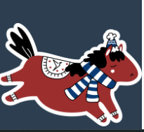
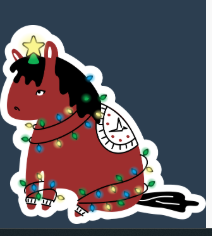
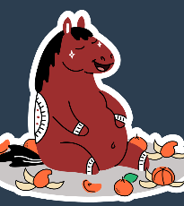

## Набор произвольных скриптов

> !!! Для работы сначала нужно [установить Tampermonkey](https://www.tampermonkey.net/), а затем устанавливать скрипты. 
> После установки списком включенных дополнений можно управлять из настроек плагина Tampermonkey в браузере.

#### Зимняя тема

1. Иннокентий мечтательный. [установить](https://github.com/sdnazarova/saby-customizer/raw/main/winter_2025/SABY-Winter-Horse-Fly-static.user.js)

2. Иннокентий в гирлянде. [установить](https://github.com/sdnazarova/saby-customizer/raw/main/winter_2025/SABY-Winter-Horse-Garland-static.user.js)

3. Иннокентий с мандаринами (большой). [установить](https://github.com/sdnazarova/saby-customizer/raw/main/winter_2025/SABY-Winter-Horse-Tangerines-Big-static.user.js)

4. Иннокентий с мандаринами (маленький). [установить](https://github.com/sdnazarova/saby-customizer/raw/main/winter_2025/SABY-Winter-Horse-Tangerines-static.user.js)

5. Иннокентий с вишевым соком. [установить](https://github.com/sdnazarova/saby-customizer/raw/main/winter_2025/SABY-Winter-Horse-Wine-static.user.js)

