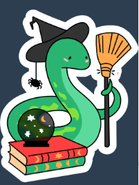
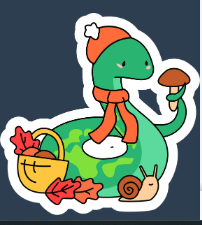
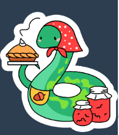

## Набор произвольных скриптов

> !!! Для работы сначала нужно [установить Tampermonkey](https://www.tampermonkey.net/), а затем устанавливать скрипты. 
> После установки списком включенных дополнений можно управлять из настроек плагина Tampermonkey в браузере.

#### Осенняя тема

1. Змейка - ведьма. [установить](https://github.com/sdnazarova/saby-customizer/raw/main/autumn_2025/SABY-Autumn-Snake-Witch-static.user.js)

2. Змейка с зонтиком. [установить](https://github.com/sdnazarova/saby-customizer/raw/main/autumn_2025/SABY-Autumn-Snake-Umbrella-static.user.js)

31. Змейка - учитель. [установить](https://github.com/sdnazarova/saby-customizer/raw/main/autumn_2025/SABY-Autumn-Snake-Teacher-static.user.js)

4. Змейка - грибник. [установить](https://github.com/sdnazarova/saby-customizer/raw/main/autumn_2025/SABY-Autumn-Snake-Mushrooms-static.user.js)

5. Змейка - пекарь. [установить](https://github.com/sdnazarova/saby-customizer/raw/main/autumn_2025/SABY-Autumn-Snake-Bakery-static.user.js)

