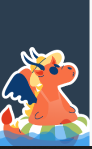
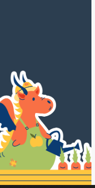
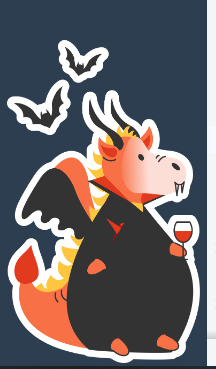
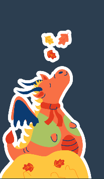
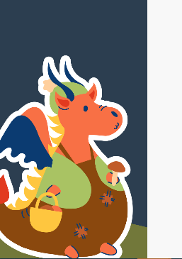
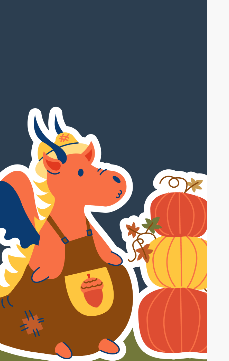
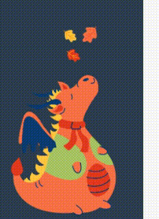

## Набор произвольных скриптов

> !!! Для работы сначала нужно [установить Tampermonkey](https://www.tampermonkey.net/), а затем устанавливать скрипты. 
> После установки списком включенных дополнений можно управлять из настроек плагина Tampermonkey в браузере.

<!-- #### Весенняя тема

1.  Дракончик в меню. [установить](https://github.com/sdnazarova/saby-customizer/raw/main/spring_2024/SABY-Spring-Dragon.user.js)

2.  Выезжающий дракон. [установить](https://github.com/sdnazarova/saby-customizer/raw/main/spring_2024/SABY-Spring-Dragon-Moovied.user.js)

 -->

<!--#### Летняя тема

1. Дракончик плавающий. [установить](https://github.com/sdnazarova/saby-customizer/raw/main/summer_2024/SABY-Summer-Dragon-Swimming.user.js)

2. Дракончик садовник. [установить](https://github.com/sdnazarova/saby-customizer/raw/main/summer_2024/SABY-Summer-Dragon-Carrot.user.js)

3. Дракончик в волнах на учебный портал. [установить](https://github.com/sdnazarova/saby-customizer/raw/main/summer_2024/SABY-Summer-Dragon-Moovied-Waves.user.js)

-->
#### Осенняя тема
1. Дракончик - Учитель. [установить](https://github.com/sdnazarova/saby-customizer/raw/main/autumn_2024/SABY-Autumn-Dragon-helloween.user.js)

2. Дракончик - Учитель. [установить](https://github.com/sdnazarova/saby-customizer/raw/main/autumn_2024/SABY-Autumn-Dragon-teacher-day.user.js)

3. Дракончик в листопаде статичный. [установить](https://github.com/sdnazarova/saby-customizer/raw/main/autumn_2024/SABY-Autumn-Dragon-leaf-fall-static.user.js)

4. Дракончик грибник. [установить](https://github.com/sdnazarova/saby-customizer/raw/main/autumn_2024/SABY-Autumn-Dragon-mushroomer.user.js)

5. Дракончик с тыквами. [установить](https://github.com/sdnazarova/saby-customizer/raw/main/autumn_2024/SABY-Autumn-Dragon-pumpkin.user.js)

6. Дракончик в листопаде. [установить](https://github.com/sdnazarova/saby-customizer/raw/main/autumn_2024/SABY-Summer-Dragon-leaf-fall.user.js)

