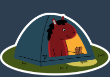
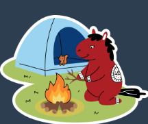

## Набор произвольных скриптов

> !!! Для работы сначала нужно [установить Tampermonkey](https://www.tampermonkey.net/), а затем устанавливать скрипты. 
> После установки списком включенных дополнений можно управлять из настроек плагина Tampermonkey в браузере.

#### Летняя тема

1. Иннокентий жарит шашлык. [установить](https://github.com/sdnazarova/saby-customizer/raw/main/summer_2026/SABY-Spring-Horse-Barbecue-static.user.js)

2. Иннокентий в палаточке. [установить](https://github.com/sdnazarova/saby-customizer/raw/main/summer_2026/SABY-Spring-Horse-Tent-static.user.js)

3. Иннокентий на кемпинге. [установить](https://github.com/sdnazarova/saby-customizer/raw/main/summer_2026/SABY-Spring-Horse-Camping-static.user.js)

4. Иннокентий на пляже. [установить](https://github.com/sdnazarova/saby-customizer/raw/main/summer_2026/SABY-Spring-Horse-Plage-static.user.js)

