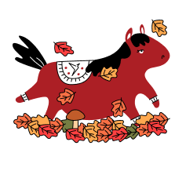

## Набор произвольных скриптов

> !!! Для работы сначала нужно [установить Tampermonkey](https://www.tampermonkey.net/), а затем устанавливать скрипты. 
> После установки списком включенных дополнений можно управлять из настроек плагина Tampermonkey в браузере.

#### Вдохновение

«Лучший день — сегодня» [установить](https://github.com/sdnazarova/saby-customizer/raw/main/autumn_2026/SABY-Autumn-lotus-button.user.js)

#### Осенняя тема 

Иннокентий в листьях [установить](https://github.com/sdnazarova/saby-customizer/raw/main/autumn_2026/SABY-Autumn-Innokentiy-leafs-static.user.js)

Иннокентий c чаем [установить](https://github.com/sdnazarova/saby-customizer/raw/main/autumn_2026/SABY-Autumn-Innokentiy-tea-static.user.js)

Иннокентий c зонтиком [установить](https://github.com/sdnazarova/saby-customizer/raw/main/autumn_2026/SABY-Autumn-Innokentiy-umbrella-static.user.js)

Иннокентий преподает [установить](https://github.com/sdnazarova/saby-customizer/raw/main/autumn_2026/SABY-Autumn-Innokentiy-teacher-static.user.js)

